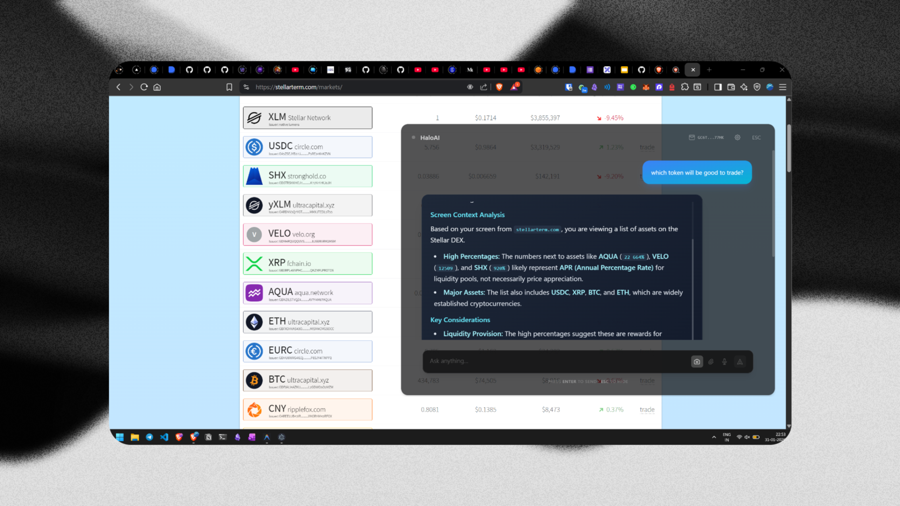
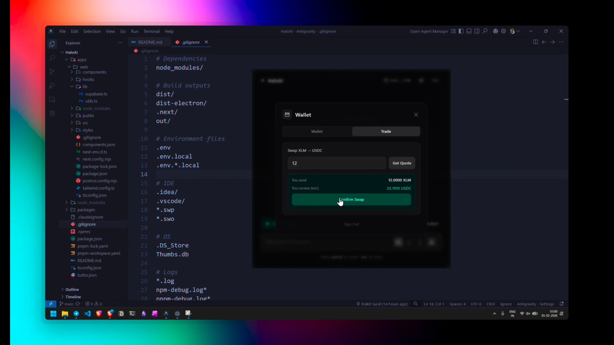
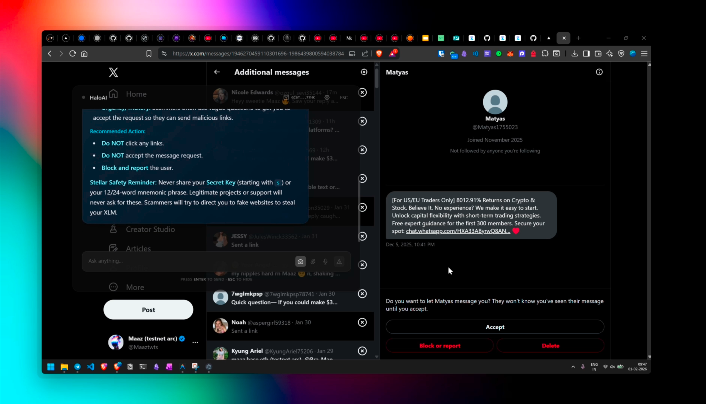

# HaloAI

<div align="center">
  <h1>The AI-Powered Stellar Assistant That Lives With You</h1>
  <p>
    <b>Powered by Stellar Blockchain</b>
  </p>
  <p>
    <a href="https://x.com/Maaztwts/status/2017852206947660037?s=20">🎥 Watch Demo</a> ·
    <a href="https://github.com/Pulkit7070/HaloAI/issues">Report Bug</a> ·
    <a href="https://github.com/Pulkit7070/HaloAI/issues">Request Feature</a> ·
    <a href="https://doc.haloai.kaizenn.xyz/">Documentation</a>
  </p>
</div>

---

## The "Why" (Our Story)

Imagine you're coding late at night, debugging a cryptic Stellar transaction error. You need help, but switching to a browser, finding ChatGPT, copying your code, and pasting it breaks your entire flow. By the time you get an answer, you've lost your mental context.

**We built HaloAI because we wanted an assistant that lives *with* us, not in a browser tab.**

We didn't want another chatbot. We wanted a "tap-on-the-shoulder" companion — something that:
- Wakes up instantly with a keyboard shortcut
- Sees your screen and understands your context
- Helps you debug, write, send crypto, and more — without leaving your workflow
- Integrates seamlessly with the Stellar blockchain for instant, transparent payments

What if your AI assistant could not only understand your code but also manage your crypto wallet, execute instant blockchain payments, and help you explore the Stellar ecosystem — all from a single, beautiful native desktop app?

**That's HaloAI.**

## Use Cases

<div align="center">
  
  <p><strong>Use case: Screen Context Analysis & Asset Exploration</strong><br>HaloAI automatically captures and analyzes what's on your screen. Here, it's viewing a Stellar DEX asset list and providing intelligent insights about liquidity pools (AQUA, VELO, SHX), major cryptocurrencies (USDC, XRP, BTC, ETH), and other Stellar tokens — helping you understand market dynamics without switching apps.</p>
</div>

<div align="center">
  
  <p><strong>Use case: Instant DEX Trading</strong><br>Swap XLM to USDC without leaving VS Code — HaloAI's wallet overlay brings Stellar DEX trading directly into your workflow.</p>
</div>

<div align="center">
  
  <p><strong>Use case: AI-Powered Safety Detection</strong><br>HaloAI automatically detects phishing attempts and scam messages on your screen, warning you before you interact — keeping you safe while browsing social media or managing DMs.</p>
</div>

## Challenges Faced

Building a production-ready desktop app with blockchain integration in record time came with hurdles:

### 1. Screen Capture Reliability (Windows 11)
- **Problem**: Electron's `desktopCapturer.getSources()` would sporadically timeout on Windows 11, especially when the app window was visible during capture.
- **Solution**: 
  - Implemented retry logic with exponential backoff (3 attempts, 5-second timeout each)
  - Added 500ms delay before capture to let Windows compositor settle
  - Hide window *before* capture to avoid capturing ourselves
- **Learning**: Platform-specific quirks require defensive programming and graceful fallbacks.

### 2. Stellar Transaction Signing with Privy
- **Problem**: Privy's server-side SDK doesn't expose direct ed25519 signing methods needed for Stellar transactions.
- **Solution**: 
  - Stored encrypted secret keys in Supabase with AES-256-GCM
  - Server-side decryption and transaction signing using Stellar SDK
  - Implemented scrypt key derivation for robust encryption
- **Learning**: Balancing security (non-custodial wallets) with UX (seamless auth) requires careful architecture.

### 3. Vision Analysis Rate Limits
- **Problem**: OpenRouter's Llama 3.2 Vision model had rate limits that would block screen analysis during rapid testing.
- **Solution**: 
  - Built tiered fallback: OpenRouter → Tesseract OCR → text-only mode
  - Added error handling that preserves AI chat functionality even without vision
  - Implemented caching to avoid redundant vision API calls
- **Learning**: Always plan for API failures with graceful degradation.

### 4. Contextual AI System Complexity
- **Problem**: HaloAI needed to detect user intent (coding vs. wallet operations) and switch system prompts accordingly.
- **Solution**: 
  - Built keyword detection for context modes (transfer, balance, coding, email, etc.)
  - Crafted specialized system prompts for each mode
  - Integrated vision context into prompts dynamically
- **Learning**: Well-designed system prompts are 80% of AI UX quality.

## What It Does

- **Instant Wake**: Double-tap your global hotkey (`Cmd+Shift+Space` on macOS, `Ctrl+Space` on Windows/Linux) to summon HaloAI. No clicks required.
- **Context Vision**: Captures your active screen instantly and analyzes it with Llama 3.2 Vision. Knows what you're working on without you explaining.
- **Dev Mode Auto-Detection**: Automatically detects when you're in an IDE (VS Code, IntelliJ, WebStorm, PyCharm, etc.) using weighted confidence scoring, extracts file names, errors, and stack traces from your screen, and switches to a terse diff-based fix prompt.
- **Smart Actions**:
  - **Debug**: Paste a stack trace? HaloAI reads it and suggests fixes with working code.
  - **Draft**: Email thread on screen? It drafts a professional reply matching your tone.
  - **Summarize**: Meeting notes scattered around? Organizes them into action items.
  - **Send Crypto**: "Send 5 XLM to Bob" — HaloAI parses intent, generates transaction JSON, and executes it.
  - **Portfolio**: "What's my balance?" — Displays real-time XLM holdings and multi-asset balances.
  - **History**: "Show my transactions" — Visualizes last 20 Stellar operations with timestamps and filtering (all/payments/trades).
  - **Explore Assets**: "What's USDC on Stellar?" — Explains custom assets and guides trustline creation.
  - **DEX Swap**: "Swap 10 XLM to USDC" — Fetches live quotes via Stellar DEX path payments, auto-enables USDC trustline if needed, and executes the swap.
- **Voice Mode**: Don't want to type? Just speak. Integrated **Deepgram** for near-instant speech-to-text.
- **Stellar Wallet**: Built-in non-custodial wallet with:
  - Automatic testnet wallet creation and funding via Friendbot
  - Send/receive XLM with natural language
  - Transaction history with StellarChain explorer links
  - Trustline management for custom Stellar assets
  - Safety warnings preventing cross-chain operations
- **Escrow Vault**: On-chain time-locked vault powered by a Soroban smart contract:
  - Deposit and withdraw any Stellar token
  - Time-lock funds with ledger-based expiry
  - Release to a recipient or reclaim after expiry
- **Strategy Commitment (ZK-Ready)**: Commit-reveal scheme for trading strategies, stored on-chain via Soroban:
  - **Commit**: Hash your trading strategy (`SHA-256(strategy + salt)`) on-chain — plaintext stays private
  - **Attach Proof**: Link a proof hash to your commitment and trade transaction after executing a swap
  - **Reveal**: Unmask your strategy on-chain at any time — the contract verifies the hash matches
  - Private Strategy Mode toggle in the wallet UI for stamping trades with verifiable strategy proofs
  - ZK-ready boundary — swap SHA-256 for real zero-knowledge proofs in production

## Tech Stack

This project uses a modern monorepo architecture managed by **TurboRepo** and **pnpm workspaces**.

### Desktop App (`apps/desktop`)

- **Framework**: [Electron 28](https://www.electronjs.org/) + [Vite 5](https://vitejs.dev/)
- **Frontend**: [React 18](https://react.dev/) + [TypeScript](https://www.typescriptlang.org/)
- **Styling**: [TailwindCSS 3.4](https://tailwindcss.com/) with glassmorphism design
- **UI Components**: react-markdown, react-syntax-highlighter for rich message rendering
- **Vision**: OpenRouter (Llama 3.2 Vision) / Tesseract.js (OCR Fallback)
- **Voice**: [Deepgram API](https://deepgram.com/) for speech-to-text
- **Screen Capture**: Electron desktopCapturer with retry logic
- **Authentication**: [Privy](https://privy.io/) embedded wallets
- **Storage**: Custom SimpleStore (JSON-based, pnpm-compatible) for settings and preferences
- **Deep Linking**: `halo://` protocol for Privy OAuth callbacks

### Server (`apps/server`)

- **Framework**: [Express 4](https://expressjs.com/) with TypeScript
- **Database**: [Supabase](https://supabase.com/) (PostgreSQL)
- **Blockchain**: [Stellar SDK 14.5](https://developers.stellar.org/docs/data/sdks/javascript) + [Soroban Client](https://soroban.stellar.org/)
- **Network**: Stellar Testnet (Horizon API + Soroban RPC)
- **Encryption**: AES-256-GCM with scrypt key derivation
- **API Endpoints**: Wallet CRUD, XLM transfers, DEX swaps, trustline management, vault operations, strategy commitments, proof attachments & reveals

### Web Landing (`apps/web`)

- **Framework**: [Next.js 15.2](https://nextjs.org/) (App Router)
- **UI Components**: [Shadcn/UI](https://ui.shadcn.com/) + [Framer Motion](https://www.framer.com/motion/)
- **Styling**: TailwindCSS with tailwindcss-animate
- **Forms**: react-hook-form + zod validation
- **Analytics**: Vercel Analytics

### Smart Contracts (`contracts/`)

- **Language**: Rust (Soroban SDK)
- **Network**: Stellar Testnet (Soroban RPC)
- **Strategy Commitment** (`contracts/strategy-commitment`):
  - Contract ID: `CBNYO7UL3A3254A752CNMFIFJRXH6HLIAGPM6YLSFHU27LAU4JTBY4WO`
  - Functions: `commit`, `reveal`, `attach_proof`, `reveal_proof`, `get`, `get_proof`
  - Storage: `CommitmentRecord` and `ProofRecord` with auto-incrementing IDs
- **Escrow Vault** (`contracts/escrow-vault`):
  - Contract ID: `CANZIG67XFUHEUQCRJ4ZF2BG2OPCJMWJWBQTO37MVULQFQMDTKAOACQO`
  - Functions: `init`, `deposit`, `withdraw`, `lock`, `release`, `reclaim`, `balance`, `get_lock`
  - Storage: Per-user balances, time-locked `LockEntry` records with status tracking
- **Build & Deploy**: `deploy.sh` scripts, GitHub Actions with StellarExpert's soroban-build-workflow

### AI & Infrastructure

- **Inference**: [Cerebras API](https://cerebras.ai/) (GLM-4.7 via Z.ai)
  - Model: `zai-glm-4.7`
  - Temperature: 1.0, Top-p: 0.95
  - Max tokens: 2048
  - Streaming: Enabled
- **Vision**: [OpenRouter](https://openrouter.ai/) (Llama 3.2 Vision)
- **Voice**: [Deepgram](https://deepgram.com/)
- **Package Manager**: [PNPM](https://pnpm.io/)

## Getting Started

### Prerequisites

- **Node.js 20.x** (specified in package.json engines)
- **pnpm 8.15.5+** (`npm install -g pnpm`)
- **Supabase account** (for wallet storage)
- **API Keys**:
  - Privy App ID
  - Cerebras API key
  - Deepgram API key
  - OpenRouter API key

### Installation

1. **Clone the repository**
   ```bash
   git clone https://github.com/Pulkit7070/HaloAI.git
   cd HaloAI
   ```

2. **Install dependencies**
   ```bash
   pnpm install
   ```

3. **Set up Supabase**
   
   Create a `wallets` table in your Supabase project:
   ```sql
   CREATE TABLE wallets (
     id SERIAL PRIMARY KEY,
     privy_user_id TEXT UNIQUE NOT NULL,
     public_key TEXT NOT NULL,
     encrypted_secret TEXT NOT NULL,
     created_at TIMESTAMP DEFAULT NOW()
   );
   ```

4. **Set up Environment Variables**

   **Desktop (`apps/desktop/.env`):**
   ```bash
   VITE_PRIVY_APP_ID=your_privy_app_id
   VITE_CEREBRAS_API_KEY=your_cerebras_key
   VITE_DEEPGRAM_API_KEY=your_deepgram_key
   VITE_OPENROUTER_API_KEY=your_openrouter_key
   VITE_API_URL=http://localhost:3001/api/wallets
   VITE_VAULT_CONTRACT_ID=your_escrow_vault_contract_id
   VITE_XLM_SAC_ID=your_xlm_sac_contract_id
   ```

   **Server (`apps/server/.env`):**
   ```bash
   PORT=3001
   WALLET_ENCRYPTION_KEY=your_secure_encryption_key_32_chars_min
   SUPABASE_URL=your_supabase_project_url
   SUPABASE_SERVICE_KEY=your_supabase_service_role_key
   ```

   **Web (Optional - `apps/web/.env.local`):**
   ```bash
   # Add any web-specific env vars here
   ```

### Running the App

**Development Mode:**

```bash
# Run all apps (desktop, server, web)
pnpm dev

# Run only Desktop App
pnpm desktop

# Run only Web App
pnpm web

# Run only Server
pnpm server
```

**Build for Production:**

```bash
# Build all apps
pnpm build

# Build Desktop App (creates installers)
cd apps/desktop
pnpm build        # All platforms
pnpm build:win    # Windows only
pnpm build:mac    # macOS only
```


## Project Structure

A high-level overview of our monorepo structure:

```text
Pulkit7070/HaloAI/
├── apps/
│   ├── desktop/                      # Electron Desktop App
│   │   ├── electron/
│   │   │   └── main.ts               # Main process (window, shortcuts, IPC)
│   │   ├── src/
│   │   │   ├── App.tsx               # Main React component (chat UI + intent detection)
│   │   │   ├── components/
│   │   │   │   ├── MessageBubble.tsx  # Chat with markdown rendering
│   │   │   │   ├── WalletPanel.tsx    # Tabbed wallet UI (wallet/trade/vault)
│   │   │   │   ├── WalletSendForm.tsx # XLM send form
│   │   │   │   ├── PortfolioCard.tsx  # Balance + multi-asset display
│   │   │   │   ├── TransactionHistory.tsx
│   │   │   │   ├── TransactionCard.tsx # Individual tx with explorer links
│   │   │   │   ├── SettingsModal.tsx  # Hotkey configuration
│   │   │   │   └── ErrorBoundary.tsx  # Graceful error handling
│   │   │   ├── hooks/
│   │   │   │   ├── useAI.ts           # AI chat with 20+ contextual prompts
│   │   │   │   ├── useWallet.ts       # Stellar wallet + vault + proof ops
│   │   │   │   ├── useAuth.ts         # Privy authentication
│   │   │   │   ├── useVision.ts       # Screen capture & vision analysis
│   │   │   │   └── useVoiceInput.ts   # Deepgram voice input
│   │   │   └── services/
│   │   │       ├── walletApi.ts       # API client (wallet, swap, vault, proofs)
│   │   │       ├── strategyCommitment.ts # SHA-256 commitment hash generation
│   │   │       ├── proofAttachment.ts # ZK-ready proof bundle generation
│   │   │       ├── escrowVault.ts     # Soroban vault transaction builder
│   │   │       └── devMode.ts         # IDE auto-detection & context extraction
│   │   └── package.json
│   │
│   ├── server/                       # Express API Server
│   │   ├── src/
│   │   │   ├── index.ts              # Server entry point
│   │   │   └── routes/
│   │   │       └── wallets.ts        # Wallet, swap, vault, commit, proof routes
│   │   └── package.json
│   │
│   └── web/                          # Next.js Landing Page
│       ├── app/
│       │   ├── layout.tsx
│       │   ├── page.tsx              # Landing page
│       │   └── globals.css
│       ├── components/               # Shadcn/UI components
│       │   ├── hero-section.tsx
│       │   ├── dashboard-preview.tsx
│       │   ├── bento-section.tsx
│       │   └── ... (78 components)
│       └── package.json
│
├── contracts/
│   ├── strategy-commitment/          # Soroban commit-reveal contract (Rust)
│   │   ├── src/lib.rs                # Contract logic
│   │   └── deploy.sh                 # Testnet deployment script
│   └── escrow-vault/                 # Soroban time-locked vault contract (Rust)
│       ├── src/lib.rs                # Contract logic
│       └── deploy.sh                 # Testnet deployment script
│
├── packages/
│   ├── api-client/                   # Shared API client library
│   └── ui/                           # Shared UI components
│
├── .github/workflows/
│   └── release-contracts.yml         # Soroban contract release workflow
├── package.json                      # Root workspace
├── pnpm-workspace.yaml               # pnpm workspaces
├── turbo.json                        # TurboRepo config
└── README.md
```

## Hackathon Context

- **Team**: Kaizen (Team #12)
- **Project**: Halo AI
- **Built for**: Fast-paced innovation with modern AI infrastructure
- **Focus**: Desktop-native AI assistant with embedded blockchain wallet + on-chain strategy verification
- **Tools Used**:
    - **Cline**: Rapid prototyping, monorepo scaffolding, and refactoring
    - **Cerebras**: Ultra-fast GLM-4.7 inference for instant AI responses
    - **Stellar + Soroban**: Blockchain infrastructure for payments, DEX swaps, time-locked vaults, and on-chain commit-reveal proofs
    - **Electron**: Cross-platform desktop capabilities

## The Team

**Team Kaizen** (Team #12) 🚀

- **Pulkit** - [GitHub](https://github.com/Pulkit7070)
- **Moin Akhtar** - [GitHub](https://github.com/MDMOINAKHTARR)
- **Maaz** - [GitHub](https://github.com/somewherelostt)
- **Hardik** - [GitHub](https://github.com/hardik180704)

---

<div align="center">
  <p>Made with ❤️ by <b>Team Kaizen</b></p>
  <p>Powered by <b>Cerebras GLM-4.7</b> • <b>Stellar Blockchain</b> • <b>Electron</b></p>
</div>
